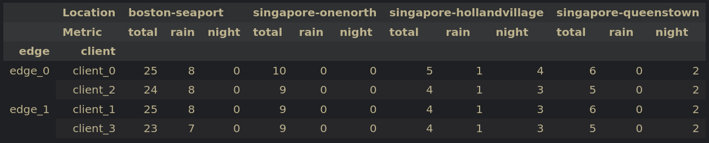
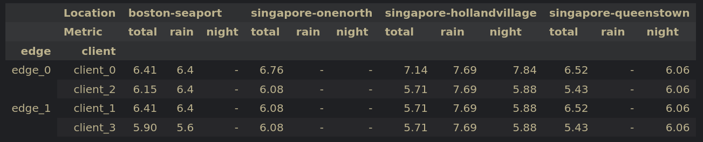

# Details
Create small (1/4 size -> `sample_fraction=0.25`) IID dataset where we try to assign the same number of scenes for night and rainy scenes for each location.

Absolute number of scenes:


Relative number of scenes compared to total number of scenes per category:


# Code
```python
from collections import defaultdict
from pathlib import Path
import random
import pickle
import json

pkl_file = "/home/rdr/Documents/master_thesis/data/nuscenes/nuscenes_infos_train.pkl"
scene_file = Path('/home/rdr/Documents/master_thesis/code/datasets/nuscenes/scene.json')
log_file = Path('/home/rdr/Documents/master_thesis/code/datasets/nuscenes/log.json')

with open(scene_file, "r") as f:
    scenes = json.load(f)
with open(log_file, "r") as f:
    logs = json.load(f)
with open(pkl_file, "rb") as f:
    data = pickle.load(f)

# Extract all scene tokens in dataset
data_tokens = set(info['scene_token'] for info in data['infos'])

def store_manifest(manifest, file):
    with open(file, "w") as f:
        json.dump(manifest, f, indent=2)

def get_data_info(train_scene_tokens, scenes, logs, sup_scenes):
    scenes_by_name = {dct['name']: dct for dct in scenes} 
    logs_by_token = {dct['token']: dct for dct in logs}

    scenes_by_token = {dct['token']: dct for dct in scenes}

    results = {}
    sup_results = {}
    for train_scene in train_scene_tokens:
        scene_info = scenes_by_token[train_scene]

        log_token = scene_info['log_token']
        scene_name = scene_info['name']
        description = scene_info['description'].lower()

        log_info = logs_by_token[log_token]
        location = log_info['location']

        if location not in results:
            results[location] = {'total': 0, 'rain': 0, 'night': 0}
        if location not in sup_results:
            sup_results[location] = {'total': 0, 'rain': 0, 'night': 0}
        
        results[location]['total'] += 1
        if 'rain' in description:
            results[location]['rain'] += 1
        if 'night' in description:
            results[location]['night'] += 1

        if scene_name in sup_scenes:
            sup_results[location]['total'] += 1
            if 'rain' in description:
                sup_results[location]['rain'] += 1
            if 'night' in description:
                sup_results[location]['night'] += 1

    return results, sup_results

def iid_day_night(num_edges, num_clients_per_edge, scenes, logs, train_scene_tokens, sample_fraction=0.25):
    categorized_scenes = {}
    for log in logs:
        location = log['location']
        log_token = log['token']

        if location not in categorized_scenes:
            categorized_scenes[location] = {
                'day_dry': [],
                'day_rain': [],
                'night_dry': [],
                'night_rain': []
            }

        for scene in scenes:
            if (scene['log_token'] == log_token) and (scene['token'] in train_scene_tokens):
                description = scene['description'].lower()

                is_night = 'night' in description
                is_rain = 'rain' in description

                if is_night and is_rain:
                    categorized_scenes[location]['night_rain'].append(scene)
                elif is_night:
                    categorized_scenes[location]['night_dry'].append(scene)
                elif is_rain:
                    categorized_scenes[location]['day_rain'].append(scene)
                else:
                    categorized_scenes[location]['day_dry'].append(scene)
    # for log in logs:
    #     location = log['location']
    #     log_token = log['token']

    #     if location not in categorized_scenes:
    #         categorized_scenes[location] = {
    #             'day': [],
    #             'night': []
    #         }

    #     for scene in scenes:
    #         if (scene['log_token'] == log_token) and (scene['token'] in train_scene_tokens):
    #             description = scene['description'].lower()
    #             if 'night' in description:
    #                 categorized_scenes[location]['night'].append(scene)
    #             else:
    #                 categorized_scenes[location]['day'].append(scene)

    num_clients = num_edges*num_clients_per_edge
    client_scenes = {i: [] for i in range(num_clients)}

    # for location, scenes_per_cat in categorized_scenes.items():
    #     for category in ['day_dry', 'day_rain', 'night_dry', 'night_rain']:
    #         scenes_list = scenes_per_cat[category]
    #         random.shuffle(scenes_list)

    #         for i, scene in enumerate(scenes_list):
    #             client_id = i % num_clients
    #             client_scenes[client_id].append(scene)
    for location, scenes_per_cat in categorized_scenes.items():
        for category in ['day_dry', 'day_rain', 'night_dry', 'night_rain']:
            scenes_list = scenes_per_cat[category]
            random.shuffle(scenes_list)

            # 🔥 Subsample while preserving proportions
            k = max(num_clients, int(len(scenes_list) * sample_fraction))
            sampled_scenes = scenes_list[:k]

            for i, scene in enumerate(sampled_scenes):
                client_id = i % num_clients
                client_scenes[client_id].append(scene)
        # for timeofday in ['day', 'night']:
        #     scenes_list = scenes_per_cat[timeofday]
        #     random.shuffle(scenes_list)

        #     for i, scene in enumerate(scenes_list):
        #         client_id = i % num_clients
        #         client_scenes[client_id].append(scene)

    clients = [i for i in range(num_clients)]
    manifest = {"edges": {}}
    for e in range(num_edges):
        edge_name = f'edge_{e}'
        manifest["edges"][edge_name] = {"clients": {}}

        for _ in range(num_clients_per_edge):
            i = random.choice(clients)
            client_name = f'client_{i}'

            scene_names = [scene['name'] for scene in client_scenes[i]]

            manifest["edges"][edge_name]["clients"][client_name] = {
                "scenes": scene_names
            }

            clients.remove(i)

    return manifest

manifest = iid_day_night(
    num_edges = 2,
    num_clients_per_edge = 2,
    scenes = scenes,
    logs = logs,
    train_scene_tokens = data_tokens
)

store_manifest(manifest, '/home/rdr/Documents/master_thesis/code/datasets/nuscenes/iid_night_rain_025.json')

import pandas as pd
import numpy as np

rows = []

for edge_id, edge_info in manifest["edges"].items():
    for client_id, client_info in edge_info["clients"].items():
        client_scenes = client_info["scenes"]

        results, client_results = get_data_info(data_tokens, scenes, logs, client_scenes)

        for location, info in results.items():
            sup_info = client_results[location]

            total_ratio = round((sup_info['total'] / info['total']) * 100, 2)

            rain_ratio = (
                round((sup_info['rain'] / info['rain']) * 100, 2)
                if info['rain'] > 0 else np.nan
            )

            night_ratio = (
                round((sup_info['night'] / info['night']) * 100, 2)
                if info['night'] > 0 else np.nan
            )

            rows.append({
                "edge": edge_id,
                "client": client_id,
                "location": location,
                "total_%": total_ratio,
                "rain_%": rain_ratio,
                "night_%": night_ratio,
                "total_scenes": sup_info['total'],
                "rain_scenes": sup_info['rain'],
                "night_scenes": sup_info['night'],
            })

df = pd.DataFrame(rows)

df = pd.DataFrame(rows)  # <-- keep as is

pivot = df.pivot_table(
    index=["edge", "client"],
    columns="location",
    # values=["total_%", "rain_%", "night_%"],
    values=["total_scenes", "rain_scenes", "night_scenes"],
    aggfunc="first"
)

pivot = pivot.swaplevel(0, 1, axis=1).sort_index(axis=1)
pivot.columns.names = ["Location", "Metric"]

# pivot = pivot.rename(columns={
#     "total_%": "total",
#     "rain_%": "rain",
#     "night_%": "night"
# }, level=1)
pivot = pivot.rename(columns={
    "total_scenes": "total",
    "rain_scenes": "rain",
    "night_scenes": "night"
}, level=1)

total_scenes = df.groupby(["edge", "client"])["total_scenes"].first()

pivot[("Total scenes", "")] = total_scenes

all_locations = df["location"].unique()
all_metrics = ["total", "rain", "night"]

full_columns = pd.MultiIndex.from_product(
    [all_locations, all_metrics],
    names=["Location", "Metric"]
)

pivot = pivot.reindex(columns=full_columns)
pivot = pivot.fillna("-")
pivot

df = pd.DataFrame(rows)  # <-- keep as is

pivot = df.pivot_table(
    index=["edge", "client"],
    columns="location",
    values=["total_%", "rain_%", "night_%"],
    # values=["total_scenes", "rain_scenes", "night_scenes"],
    aggfunc="first"
)

pivot = pivot.swaplevel(0, 1, axis=1).sort_index(axis=1)
pivot.columns.names = ["Location", "Metric"]

pivot = pivot.rename(columns={
    "total_%": "total",
    "rain_%": "rain",
    "night_%": "night"
}, level=1)
# pivot = pivot.rename(columns={
#     "total_scenes": "total",
#     "rain_scenes": "rain",
#     "night_scenes": "night"
# }, level=1)

total_scenes = df.groupby(["edge", "client"])["total_scenes"].first()

pivot[("Total scenes", "")] = total_scenes

all_locations = df["location"].unique()
all_metrics = ["total", "rain", "night"]

full_columns = pd.MultiIndex.from_product(
    [all_locations, all_metrics],
    names=["Location", "Metric"]
)

pivot = pivot.reindex(columns=full_columns)
pivot = pivot.fillna("-")
pivot
```