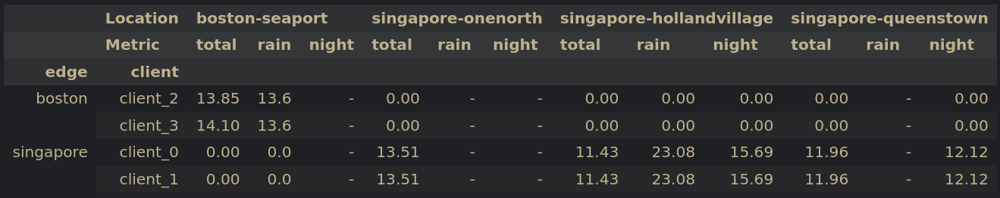
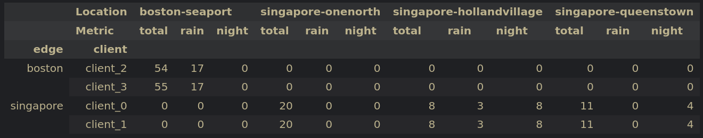

# Details
We assigned logs to each client and from the assigned logs, we selected some scenes to ensure a homogeneous distribution among clients assigned to the same edge.

The reason that the fraction of rain and night scenes for singapore-hollandvillage is quite large is that there only exist 4 logs and only one of them contain day scenes, so in order to keep a similar distribution between the two clients, we only assigned scenes from the logs without day scenes, as two clients may not contain scenes from the same log:
```
 'singapore-hollandvillage': {
  '89a56a5dc3aa4e56a2e57b52de738da5': {'rain': 0, 'night': 0, 'day': 19},
  '853a9f9fe7e84bb8b24bff8ebf23f287': {'rain': 1, 'night': 14, 'day': 0},
  'f93e8d66ce4b4fbea7062d19b1fe29fb': {'rain': 5, 'night': 0, 'day': 0},
  '8fefc430cbfa4c2191978c0df302eb98': {'rain': 7, 'night': 24, 'day': 0},
  }
```




# Code
```python
log_assignment = {
    'singapore': {
        'client_0': [
            '47620afea3c443f6a761e885273cb531',
            '7e25a2c8ea1f41c5b0da1e69ecfa71a2',
            'd0450edaed4a46f898403f45fa9e5f0d',
        ],
        'client_1': [
            '343d984344e440c7952d1e403b572b2a',
            'b5622d4dcb0d4549b813b3ffb96fbdc9',
            'da04ae0b72024818a6219d8dd138ea4b',            
        ]
    },
    'boston': {
        'client_2': [
            '8e0ced20b9d847608afcfbc23056460e',
            '20db5722b62c4c17bbff2d7b265a3c51',
            '08ba46dd716d42a69d108638fef5bbb9',
            'cb3e914a6f0b4deea0efc8521ca1e671',
        ],
        'client_3': [
            'b2685a235700404581dc7354dd5b4eda',
            'efa31cf3cd2f452789ca7f3e7541ea69',
            '6f7fe59adf984e55a82571ab4f17e4e2',
            'ab1e1b004548466f86b31f879a2d9e50',
        ]
    }
}

from pathlib import Path
import pickle
import json

# Paths to nuScenes metadata files
pkl_file = "/home/rdr/Documents/master_thesis/data/nuscenes/nuscenes_infos_train.pkl"
scene_file = Path('/home/rdr/Documents/master_thesis/code/datasets/nuscenes/scene.json')
log_file = Path('/home/rdr/Documents/master_thesis/code/datasets/nuscenes/log.json')

# Load metadata
with open(scene_file, "r") as f:
    scenes = json.load(f)
with open(log_file, "r") as f:
    logs = json.load(f)
with open(pkl_file, "rb") as f:
    data = pickle.load(f)

data_tokens = set([info['scene_token'] for info in data['infos']])

# Extract all scene tokens in training dataset
train_scene_tokens = set([info['scene_token'] for info in data['infos']])

scenes_by_log = {}
for scene in scenes:
    scene_name = scene['name']
    log_token = scene['log_token']

    if log_token not in scenes_by_log:
        scenes_by_log[log_token] = []

    scenes_by_log[log_token].append(scene_name)

manifest = {"edges": {}}

for location, clients in log_assignment.items():
    manifest["edges"][location] = {"clients": {}}

    for client, client_logs in clients.items():
        manifest["edges"][location]["clients"][client] = {"scenes": []}

        for log in client_logs:
            client_scenes = scenes_by_log[log]
            manifest["edges"][location]["clients"][client]["scenes"] += client_scenes

# Manually add scenes for singapore-hollandsvillage
manifest["edges"]['singapore']["clients"]['client_0']["scenes"] += ['scene-1074', 'scene-1081', 'scene-1094', 'scene-1075', 'scene-1082', 'scene-1092', 'scene-1097', 'scene-1105']

manifest["edges"]['singapore']["clients"]['client_1']["scenes"] += ['scene-1106', 'scene-1110', 'scene-1053', 'scene-1044', 'scene-1048', 'scene-1051', 'scene-1054', 'scene-1058']

# Manually add scenes for singapore-queenstown
manifest["edges"]['singapore']["clients"]['client_0']["scenes"] += ['scene-0992', 'scene-1010', 'scene-1005', 'scene-0999']
manifest["edges"]['singapore']["clients"]['client_0']["scenes"] += ['scene-0420', 'scene-0422', 'scene-0425', 'scene-0428', 'scene-0432', 'scene-0435', 'scene-0439']

manifest["edges"]['singapore']["clients"]['client_1']["scenes"] += ['scene-1011', 'scene-1015', 'scene-1020', 'scene-1025']
manifest["edges"]['singapore']["clients"]['client_1']["scenes"] += ['scene-0847', 'scene-0851', 'scene-0853', 'scene-0856', 'scene-0862', 'scene-0864', 'scene-0866']

import numpy as np
import pandas as pd

def get_data_info(train_scene_tokens, scenes, logs, sup_scenes):
    scenes_by_name = {dct['name']: dct for dct in scenes} 
    logs_by_token = {dct['token']: dct for dct in logs}

    scenes_by_token = {dct['token']: dct for dct in scenes}

    results = {}
    sup_results = {}
    for train_scene in train_scene_tokens:
        scene_info = scenes_by_token[train_scene]

        log_token = scene_info['log_token']
        scene_name = scene_info['name']
        description = scene_info['description'].lower()

        log_info = logs_by_token[log_token]
        location = log_info['location']

        if location not in results:
            results[location] = {'total': 0, 'rain': 0, 'night': 0}
        if location not in sup_results:
            sup_results[location] = {'total': 0, 'rain': 0, 'night': 0}
        
        results[location]['total'] += 1
        if 'rain' in description:
            results[location]['rain'] += 1
        if 'night' in description:
            results[location]['night'] += 1

        if scene_name in sup_scenes:
            sup_results[location]['total'] += 1
            if 'rain' in description:
                sup_results[location]['rain'] += 1
            if 'night' in description:
                sup_results[location]['night'] += 1

    return results, sup_results


rows = []

for edge_id, edge_info in manifest["edges"].items():
    for client_id, client_info in edge_info["clients"].items():
        client_scenes = client_info["scenes"]

        results, client_results = get_data_info(data_tokens, scenes, logs, client_scenes)

        for location, info in results.items():
            sup_info = client_results[location]

            total_ratio = round((sup_info['total'] / info['total']) * 100, 2)

            rain_ratio = (
                round((sup_info['rain'] / info['rain']) * 100, 2)
                if info['rain'] > 0 else np.nan
            )

            night_ratio = (
                round((sup_info['night'] / info['night']) * 100, 2)
                if info['night'] > 0 else np.nan
            )

            rows.append({
                "edge": edge_id,
                "client": client_id,
                "location": location,
                "total_%": total_ratio,
                "rain_%": rain_ratio,
                "night_%": night_ratio,
                "total_scenes": sup_info['total'],
                "rain_scenes": sup_info['rain'],
                "night_scenes": sup_info['night'],
            })

df = pd.DataFrame(rows)

df = pd.DataFrame(rows)  # <-- keep as is

pivot = df.pivot_table(
    index=["edge", "client"],
    columns="location",
    # values=["total_%", "rain_%", "night_%"],
    values=["total_scenes", "rain_scenes", "night_scenes"],
    aggfunc="first"
)

pivot = pivot.swaplevel(0, 1, axis=1).sort_index(axis=1)
pivot.columns.names = ["Location", "Metric"]

# pivot = pivot.rename(columns={
#     "total_%": "total",
#     "rain_%": "rain",
#     "night_%": "night"
# }, level=1)
pivot = pivot.rename(columns={
    "total_scenes": "total",
    "rain_scenes": "rain",
    "night_scenes": "night"
}, level=1)

total_scenes = df.groupby(["edge", "client"])["total_scenes"].first()

pivot[("Total scenes", "")] = total_scenes

all_locations = df["location"].unique()
all_metrics = ["total", "rain", "night"]

full_columns = pd.MultiIndex.from_product(
    [all_locations, all_metrics],
    names=["Location", "Metric"]
)

pivot = pivot.reindex(columns=full_columns)
pivot = pivot.fillna("-")
pivot

df = pd.DataFrame(rows)  # <-- keep as is

pivot = df.pivot_table(
    index=["edge", "client"],
    columns="location",
    values=["total_%", "rain_%", "night_%"],
    # values=["total_scenes", "rain_scenes", "night_scenes"],
    aggfunc="first"
)

pivot = pivot.swaplevel(0, 1, axis=1).sort_index(axis=1)
pivot.columns.names = ["Location", "Metric"]

pivot = pivot.rename(columns={
    "total_%": "total",
    "rain_%": "rain",
    "night_%": "night"
}, level=1)
# pivot = pivot.rename(columns={
#     "total_scenes": "total",
#     "rain_scenes": "rain",
#     "night_scenes": "night"
# }, level=1)

total_scenes = df.groupby(["edge", "client"])["total_scenes"].first()

pivot[("Total scenes", "")] = total_scenes

all_locations = df["location"].unique()
all_metrics = ["total", "rain", "night"]

full_columns = pd.MultiIndex.from_product(
    [all_locations, all_metrics],
    names=["Location", "Metric"]
)

pivot = pivot.reindex(columns=full_columns)
pivot = pivot.fillna("-")
pivot
```