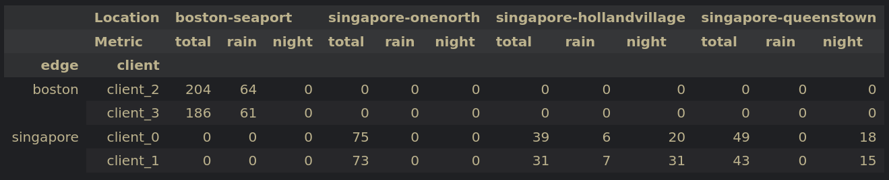
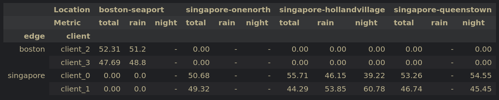

# Info
Non-iid distribution constructed from entire training set to balance number of night and rain scenes for each client assigned to the same edge server (location based).




# Code
```python
log_assignment = {
    'singapore': {
        'client_0': [
            '6b6513e6c8384cec88775cae30b78c0e',
            '47620afea3c443f6a761e885273cb531',
            'bc41a49366734ebf978d6a71981537dc',
            'd7fd2bb9696d43af901326664e42340b',
            'f38ef5a1e9c941aabb2155768670b92a',
            '7e25a2c8ea1f41c5b0da1e69ecfa71a2',
            '34d0574ea8f340179c82162c6ac069bc',
            '343d984344e440c7952d1e403b572b2a',
            'da04ae0b72024818a6219d8dd138ea4b',
            'd0450edaed4a46f898403f45fa9e5f0d',
            '6175c3299ae0482791f4ab1e9d54b326',
            '6f5b61bfb298454eb6fe7ba279792815',
            '75f5ca2350b346d19a39aa7439f61755',
            '89a56a5dc3aa4e56a2e57b52de738da5',
            '853a9f9fe7e84bb8b24bff8ebf23f287',
            'f93e8d66ce4b4fbea7062d19b1fe29fb'
        ],
        'client_1': [
            'b5622d4dcb0d4549b813b3ffb96fbdc9',
            'ddc03471df3e4c9bb9663629a4097743',
            'f8699afb7a2247e38549e4d250b4581b',
            'eda311bda86f4e54857b0554639d6426',
            '1c9b302455ff44a9a290c372b31aa3ce',
            '0986cb758b1d43fdaa051ab23d45582b',
            '700b800c787842ba83493d9b2775234a',
            'c9b039c47ec54cc7b5c0fcc7a5730e38',
            '0f1b01dd18d8438794fb3445517633df',
            '18f99982fba24684a9ea03c0cdc53fc8',
            '2f3c08142bc04ac3af6a8cf6c721b816',
            '8fefc430cbfa4c2191978c0df302eb98'
        ]
    },
    'boston': {
        'client_2': [
            'b2685a235700404581dc7354dd5b4eda',
            '69271ec7af1f446ca16820ac46d2047a',
            '84ff0dbb8d7343ab95e776c4955d5884',
            '8aa38e0d963f48ba84708bc8eb1a07c2',
            '7a0fde44c3504eaeb18f9ad83bed65bc',
            'b05f285d53744542a3413476d6dd9270',
            'ab1e1b004548466f86b31f879a2d9e50',
            '3313a6a85b264e4c86ee44d6e6329cf3',
            '08ba46dd716d42a69d108638fef5bbb9',
            'cb3e914a6f0b4deea0efc8521ca1e671',
            '6434493562e64d9aa36774bf8d98870e',
            '169c1773af08486c80ed3e9540528290'
        ],
        'client_3': [
            '65629cfc47fe489fabc497ead466a313',
            '246e7da6bb344941bac92be421a545e2',
            '8e0ced20b9d847608afcfbc23056460e',
            '6f7fe59adf984e55a82571ab4f17e4e2',
            'efa31cf3cd2f452789ca7f3e7541ea69',
            '20db5722b62c4c17bbff2d7b265a3c51',
            '6577357788b24c35a3b0419c138f50db',
            '6c12081a828548b6b0a36f12d53be6ca',
            '4de1fda752ae4cf8b650a5245734eb4c',
            '3a43824b84534c98bda1d07548db5817',
            '246e7da6bb344941bac92be421a545e2'
        ]
    }
}

from pathlib import Path
import pickle
import json

# Paths to nuScenes metadata files
pkl_file = "/home/rdr/Documents/master_thesis/data/nuscenes/nuscenes_infos_train.pkl"
scene_file = Path('/home/rdr/Documents/master_thesis/code/datasets/nuscenes/scene.json')
log_file = Path('/home/rdr/Documents/master_thesis/code/datasets/nuscenes/log.json')

# Load metadata
with open(scene_file, "r") as f:
    scenes = json.load(f)
with open(log_file, "r") as f:
    logs = json.load(f)
with open(pkl_file, "rb") as f:
    data = pickle.load(f)

data_tokens = set([info['scene_token'] for info in data['infos']])

# Extract all scene tokens in training dataset
train_scene_tokens = set([info['scene_token'] for info in data['infos']])

scenes_by_log = {}
for scene in scenes:
    scene_name = scene['name']
    log_token = scene['log_token']

    if log_token not in scenes_by_log:
        scenes_by_log[log_token] = []

    scenes_by_log[log_token].append(scene_name)

manifest = {"edges": {}}

for location, clients in log_assignment.items():
    manifest["edges"][location] = {"clients": {}}

    for client, client_logs in clients.items():
        manifest["edges"][location]["clients"][client] = {"scenes": []}

        for log in client_logs:
            client_scenes = scenes_by_log[log]
            manifest["edges"][location]["clients"][client]["scenes"] += client_scenes

import numpy as np
import pandas as pd

def get_data_info(train_scene_tokens, scenes, logs, sup_scenes):
    scenes_by_name = {dct['name']: dct for dct in scenes} 
    logs_by_token = {dct['token']: dct for dct in logs}

    scenes_by_token = {dct['token']: dct for dct in scenes}

    results = {}
    sup_results = {}
    for train_scene in train_scene_tokens:
        scene_info = scenes_by_token[train_scene]

        log_token = scene_info['log_token']
        scene_name = scene_info['name']
        description = scene_info['description'].lower()

        log_info = logs_by_token[log_token]
        location = log_info['location']

        if location not in results:
            results[location] = {'total': 0, 'rain': 0, 'night': 0}
        if location not in sup_results:
            sup_results[location] = {'total': 0, 'rain': 0, 'night': 0}
        
        results[location]['total'] += 1
        if 'rain' in description:
            results[location]['rain'] += 1
        if 'night' in description:
            results[location]['night'] += 1

        if scene_name in sup_scenes:
            sup_results[location]['total'] += 1
            if 'rain' in description:
                sup_results[location]['rain'] += 1
            if 'night' in description:
                sup_results[location]['night'] += 1

    return results, sup_results


rows = []

for edge_id, edge_info in manifest["edges"].items():
    for client_id, client_info in edge_info["clients"].items():
        client_scenes = client_info["scenes"]

        results, client_results = get_data_info(data_tokens, scenes, logs, client_scenes)

        for location, info in results.items():
            sup_info = client_results[location]

            total_ratio = round((sup_info['total'] / info['total']) * 100, 2)

            rain_ratio = (
                round((sup_info['rain'] / info['rain']) * 100, 2)
                if info['rain'] > 0 else np.nan
            )

            night_ratio = (
                round((sup_info['night'] / info['night']) * 100, 2)
                if info['night'] > 0 else np.nan
            )

            rows.append({
                "edge": edge_id,
                "client": client_id,
                "location": location,
                "total_%": total_ratio,
                "rain_%": rain_ratio,
                "night_%": night_ratio,
                "total_scenes": sup_info['total'],
                "rain_scenes": sup_info['rain'],
                "night_scenes": sup_info['night'],
            })

df = pd.DataFrame(rows)

df = pd.DataFrame(rows)  # <-- keep as is

pivot = df.pivot_table(
    index=["edge", "client"],
    columns="location",
    # values=["total_%", "rain_%", "night_%"],
    values=["total_scenes", "rain_scenes", "night_scenes"],
    aggfunc="first"
)

pivot = pivot.swaplevel(0, 1, axis=1).sort_index(axis=1)
pivot.columns.names = ["Location", "Metric"]

# pivot = pivot.rename(columns={
#     "total_%": "total",
#     "rain_%": "rain",
#     "night_%": "night"
# }, level=1)
pivot = pivot.rename(columns={
    "total_scenes": "total",
    "rain_scenes": "rain",
    "night_scenes": "night"
}, level=1)

total_scenes = df.groupby(["edge", "client"])["total_scenes"].first()

pivot[("Total scenes", "")] = total_scenes

all_locations = df["location"].unique()
all_metrics = ["total", "rain", "night"]

full_columns = pd.MultiIndex.from_product(
    [all_locations, all_metrics],
    names=["Location", "Metric"]
)

pivot = pivot.reindex(columns=full_columns)
pivot = pivot.fillna("-")
pivot

df = pd.DataFrame(rows)  # <-- keep as is

pivot = df.pivot_table(
    index=["edge", "client"],
    columns="location",
    values=["total_%", "rain_%", "night_%"],
    # values=["total_scenes", "rain_scenes", "night_scenes"],
    aggfunc="first"
)

pivot = pivot.swaplevel(0, 1, axis=1).sort_index(axis=1)
pivot.columns.names = ["Location", "Metric"]

pivot = pivot.rename(columns={
    "total_%": "total",
    "rain_%": "rain",
    "night_%": "night"
}, level=1)
# pivot = pivot.rename(columns={
#     "total_scenes": "total",
#     "rain_scenes": "rain",
#     "night_scenes": "night"
# }, level=1)

total_scenes = df.groupby(["edge", "client"])["total_scenes"].first()

pivot[("Total scenes", "")] = total_scenes

all_locations = df["location"].unique()
all_metrics = ["total", "rain", "night"]

full_columns = pd.MultiIndex.from_product(
    [all_locations, all_metrics],
    names=["Location", "Metric"]
)

pivot = pivot.reindex(columns=full_columns)
pivot = pivot.fillna("-")
pivot
```