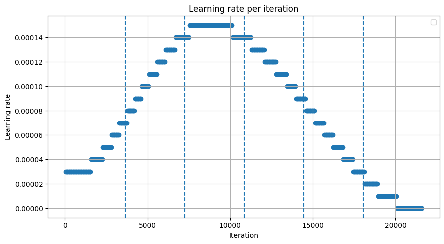
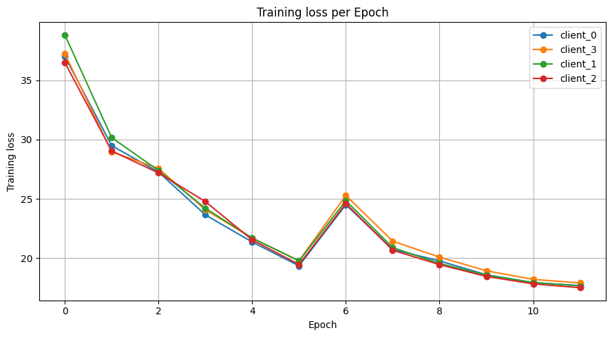
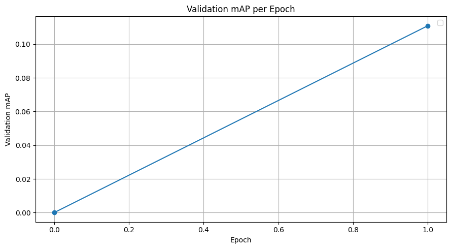

**Context** - Initial experiment

**Details**
- Commit: c7e0a6ca07f25f99f2460c0b640015003f175645 (might be wrong)
- No CBGSDataset $\rightarrow$ Epochs much smaller than with CBGSDataset (about 1/4 the size).
- No `ObjectSample`

```python
from hfl.coordinator import Coordinator
from mmcv import print_log

def main():
    print_log(f"Constructing coordinator...", logger='root' )

    base_lr = 0.0001 / 4
    num_local_rounds = 2
    num_edge_rounds = 3
    num_global_rounds = 2

    cloud = Coordinator(
        work_root = "/tudelft.net/staff-umbrella/rdramautar/HFL/experiments/exp_016",
        base_cfg_path = "/tudelft.net/staff-umbrella/rdramautar/HFL/configs/cmt_lidar_cyclic_lr.py",
        val_cfg_path = "/tudelft.net/staff-umbrella/rdramautar/HFL/configs/cmt_lidar_cyclic_lr_val.py",
        manifest_path = "/tudelft.net/staff-umbrella/rdramautar/HFL/data/iid_day_night_2edges_4clients.json",
        init_ckpt_path = None,
        num_local_rounds = num_local_rounds,
        num_edge_rounds = num_edge_rounds,
        num_global_rounds = num_global_rounds,
        lr_cfg = {
            'policy': "cyclic",
            'total_epochs': num_local_rounds * num_edge_rounds * num_global_rounds,
            'initial_lr': base_lr,
            'min_lr': 0.0001*base_lr,
            'max_lr': 6*base_lr
        },
        token_to_name_path = "/tudelft.net/staff-umbrella/rdramautar/HFL/data/scene_name_to_token.json",
        seed = 0
    )
    print_log(f"Coordinator constructed. Starting training...", logger='root' )

    cloud.train()

if __name__ == '__main__':
    main()
```


**Results**
```
Global round 0
  edge_0
    Round 0
      client_0
      Epoch 0 - Loss 37.00793667826529
      Epoch 1 - Loss 29.489068054911524
      client_3
      Epoch 0 - Loss 37.2350128807037
      Epoch 1 - Loss 28.965547193192968
    Round 1
      client_0
      Epoch 0 - Loss 27.26597359424501
      Epoch 1 - Loss 23.648580264723343
      client_3
      Epoch 0 - Loss 27.572235612665178
      Epoch 1 - Loss 24.081811618087883
    Round 2
      client_0
      Epoch 0 - Loss 21.364694545990435
      Epoch 1 - Loss 19.349510083987017
      client_3
      Epoch 0 - Loss 21.69533563418634
      Epoch 1 - Loss 19.77370305610158
  edge_1
    Round 0
      client_1
      Epoch 0 - Loss 38.83058655423816
      Epoch 1 - Loss 30.166996338788202
      client_2
      Epoch 0 - Loss 36.49722919019027
      Epoch 1 - Loss 29.04582462299935
    Round 1
      client_1
      Epoch 0 - Loss 27.391432023156284
      Epoch 1 - Loss 24.204796927007614
      client_2
      Epoch 0 - Loss 27.189000489566567
      Epoch 1 - Loss 24.771990356488736
    Round 2
      client_1
      Epoch 0 - Loss 21.696869211498967
      Epoch 1 - Loss 19.76659228359412
      client_2
      Epoch 0 - Loss 21.541211397456525
      Epoch 1 - Loss 19.463418690264056
Global round 1
  edge_0
    Round 0
      client_0
      Epoch 0 - Loss 24.5080339841553
      Epoch 1 - Loss 20.74056259665902
      client_3
      Epoch 0 - Loss 25.290099452312727
      Epoch 1 - Loss 21.437708944582127
    Round 1
      client_0
      Epoch 0 - Loss 19.76718448600297
      Epoch 1 - Loss 18.59866920284533
      client_3
      Epoch 0 - Loss 20.08647128789669
      Epoch 1 - Loss 18.937250667944888
    Round 2
      client_0
      Epoch 0 - Loss 17.943028765936937
      Epoch 1 - Loss 17.684825728795122
      client_3
      Epoch 0 - Loss 18.21199764717239
      Epoch 1 - Loss 17.91005161058151
  edge_1
    Round 0
      client_1
      Epoch 0 - Loss 24.843106804929707
      Epoch 1 - Loss 20.893008553064785
      client_2
      Epoch 0 - Loss 24.60709570861365
      Epoch 1 - Loss 20.66973064565903
    Round 1
      client_1
      Epoch 0 - Loss 19.5527899686028
      Epoch 1 - Loss 18.56044035152073
      client_2
      Epoch 0 - Loss 19.45466734702165
      Epoch 1 - Loss 18.45826140899311
    Round 2
      client_1
      Epoch 0 - Loss 17.940263585267562
      Epoch 1 - Loss 17.65848452904645
      client_2
      Epoch 0 - Loss 17.83032718380541
      Epoch 1 - Loss 17.506749697008388
```







**Next steps**

- Implement CBGSDataset and `ObjectSample` to remain closer to centralized training method.
- Train for longer, as current results show no bugs or mistakes.
